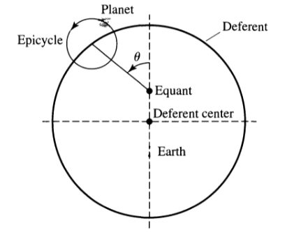

天球
====

地心说
------

古希腊人最早根据观测直觉，认为天体围绕地球转，提出**天球坐标**，如下图

提出本轮、均轮、equant来解释**逆行运动**

日心说
------

内行星：位于地球轨道以内的行星。相对于太阳最大的角间距称为**东、西大距**，此时视亮度最大。

外行星：位于地球轨道以外的行星。亮度最大处称为照。

合：从地球上看，跑到太阳一侧，对于内行星，在太阳背后叫上合，在太阳前面叫下合

冲：从地球上看，跑到太阳反方向

会合周期（S）：相邻两次冲或合（相对地球）的时间间隔

恒星周期（P）：完成一次公转所需要的时间

$$
1/S=
  \begin{cases}
    1/P-1/P_{\oplus}\ \text{(内行星)} \\
    1/P_{\oplus}-1/P\ \text{(外行星)}
  \end{cases}
$$

天球坐标
--------

### 高度方位坐标系

\centering
![高度方位坐标系[]{label="fig:altitude"}](chapters/01/altitude){width="6cm"}

高度角$h$：天体与水平面的夹角，如图[\[fig:altitude\]](#fig:altitude){reference-type="ref"
reference="fig:altitude"}

天顶：观测者正上方

天顶距$z$：天体与天顶的夹角

方位角$A$：从某点的指北方向线（通常用子午线，即经线）起依顺时针（东）方向至目标方向线间的水平夹角

地球的自转轨道面（赤道面）和公转轨道面（黄道面）存在夹角（黄赤交角），因此在一年中太阳的直射点会发生变化，由此定义春分点、夏至点、秋分点、冬至点。

太阳时：太阳经过子午线的平均间隔（考虑地球自转）

恒星时：背景恒星经过子午线的平均间隔

### 赤道坐标系

\centering
![赤道坐标系[]{label="fig:equatorial"}](chapters/01/equatorial){width="6cm"}

赤纬$\delta$：等价于纬度

赤经$\alpha$：自春分点依顺时针（东）方向至被测点所在时圈的时差，一周24小时等价于360$^\circ$，1h=15$^\circ$，1m=15$'$
，1s=15$''$

本地恒星时：观测者所在子午线的赤经

**进动（岁差）**会导致天体的赤经、赤纬发生变化（因为春分点发生变化），因此要确定一个特定的时期来确定春分点的变化，对赤道坐标作出修正
，这个时期被定义为2000年1月1日正午英国格林尼治的观测值（J2000.0)

$$\begin{aligned}
  \Delta\alpha &=M+N \sin\alpha \tan\delta \\
  \Delta\delta &=N\cos\alpha\end{aligned}$$

其中

$$\begin{aligned}
  M &=1^\circ.2812323T+0.^\circ0003879T^2+0.^\circ0000101T^3 \notag \\
  N &=0^\circ.5567530T-0.^\circ0001185T^2-0.^\circ0000116T^3 \notag\end{aligned}$$

其中$T$定义为

$$T=(t-2000.0)/100$$

其中$t$是当前时间，以年的分数来表示。

### 自行

天体本身通常具有相对太阳运动，其速度可分解为视向速度$v_r$和切向速度$v_\theta$,而切向速度会导致天体的坐标发生变化，这种运动被称为**自行**
$$\mu\equiv{d\theta\over dt} ={v_\theta \over r}$$

\centering
![自行示意图[]{label="fig:proper"}](chapters/01/propermotion){width="6cm"}

考虑到在天球上运动的几何关系如图[\[fig:proper\]](#fig:proper){reference-type="ref"
reference="fig:proper"}，且天体是沿位置角$\phi$运动，可以得到
$$\begin{aligned}
   \Delta\alpha &=\Delta\theta{\sin \phi \over \cos \delta}\\
   \Delta\delta &=\Delta\theta\cos\phi\\
   (\Delta\theta)^2 &=(\Delta\alpha\cos\delta)^2+(\Delta\delta)^2\end{aligned}$$

